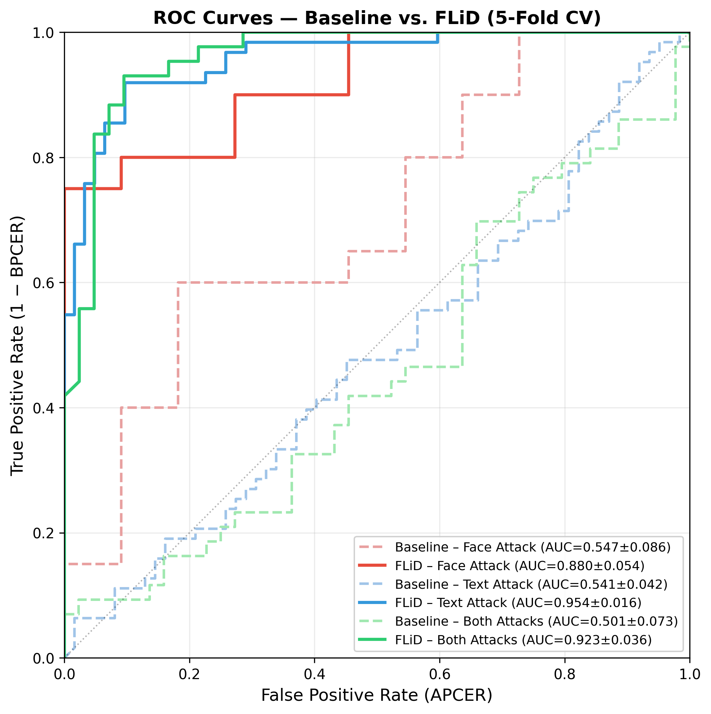
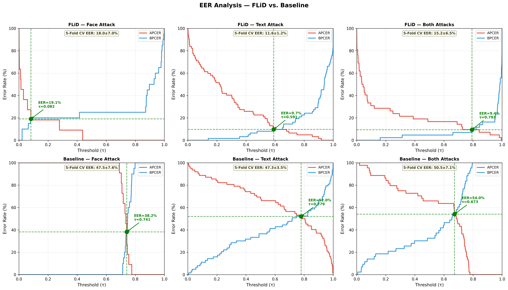

# FLiD: Field-Localised Identity-Document Forgery Detection

Official code for **"FLiD: Field-Localised Identity-Document Forgery Detection via Frozen-Backbone Embeddings"** (ECCV 2026 submission).

FLiD is a lightweight presentation-attack detection (PAD) method for
identity documents that decomposes each document into semantically
meaningful fields (face photograph, textual data) and classifies them
independently using **frozen MobileNetV3-Small embeddings** fed into
lightweight MLP heads.

---

## Key Results (5-fold Stratified CV)

| Attack   | AUC            | EER (%)         | BPCER\@10  | BPCER\@20  | BPCER\@50  |
|----------|---------------|----------------|-----------|-----------|-----------|
| **Face** | 0.880 ± 0.054 | 18.05 ± 7.04  | 23.0 ± 12.1 | 45.0 ± 29.7 | 45.0 ± 29.7 |
| **Text** | 0.954 ± 0.016 | 11.61 ± 1.21  | 11.9 ± 2.2  | 21.2 ± 5.9  | 37.2 ± 16.9 |
| **Both** | 0.923 ± 0.036 | 15.16 ± 6.45  | 20.4 ± 11.1 | 35.1 ± 15.3 | 51.1 ± 22.3 |

The baseline (Gonzalez & Tapia, MobileNetV2 from scratch) achieves
near-chance performance on the same folds (AUC ≈ 0.50–0.55).

### Efficiency

| Method     | Trainable Params | FLOPs   | Latency (CPU) |
|-----------|-----------------|---------|--------------|
| **FLiD**  | 191 K            | 119 M   | 16.8 ms       |
| Baseline  | 2.55 M           | 2503 M  | 37 ms         |

13× fewer parameters · 21× fewer FLOPs · 2.2× faster

### Sample Figures

<p align="center">
  
</p>
<p align="center"><em>ROC curves — FLiD vs baseline vs general-purpose detectors</em></p>

<p align="center">
  
</p>
<p align="center"><em>EER distributions across 5-fold CV</em></p>

> **All pre-computed results** (JSONs + 18 plots) are in [`results/`](results/README.md).

---

## Repository Structure

```
FLiD/
├── README.md
├── requirements.txt
├── LICENSE
├── .gitignore
├── configs/
│   └── paths.py              # All dataset & output paths (edit BASE here)
├── flid/                     # FLiD approach (ours)
│   ├── models.py             # MobileNetV3 extractor + MLP classifiers
│   ├── metrics.py            # ISO/IEC 30107-3 metrics (EER, BPCER)
│   ├── data.py               # Embedding & image-path loaders
│   └── train_kfold.py        # 5-fold CV training + bootstrap CIs
├── baseline/                 # Gonzalez & Tapia re-implementation
│   ├── model.py              # MobileNetV2PAD (from scratch)
│   ├── train.py              # Single train/test run
│   └── train_kfold.py        # 5-fold CV training
├── yolo/                     # YOLOv8 field detector
│   ├── finetune.py           # Fine-tune YOLOv8m
│   ├── generate_annotations.py
│   ├── crop_faces.py         # Face-region extraction
│   └── crop_text.py          # Text-region extraction
├── evaluation/               # Analysis & ablation scripts
│   ├── efficiency.py         # Params / FLOPs / latency
│   ├── ablation.py           # Five ablation studies
│   └── fair_comparison.py    # YOLO vs coord-crop comparison
├── results/                  # Pre-computed results & paper figures
│   ├── README.md             # Detailed description of all results
│   ├── kfold/                # 5-fold CV JSONs (FLiD + baseline)
│   ├── ablation/             # Ablation, efficiency, YOLO comparison JSONs
│   └── plots/                # All 18 paper figures (ROC, EER, DET, etc.)
└── scripts/
    └── run_all.sh            # Reproduce all experiments
```

---

## Quick Start

### 1. Install dependencies

```bash
python -m venv .venv && source .venv/bin/activate
pip install -r requirements.txt
```

### 2. Configure paths

Edit `configs/paths.py` and set `BASE` to point to the root directory
containing your data:

```python
BASE = Path('/path/to/your/data')
```

See the docstring in `configs/paths.py` for the full expected directory
layout.

### 3. Run FLiD 5-fold CV

```bash
python -m flid.train_kfold                  # all three attacks
python -m flid.train_kfold --attack Face    # single attack
```

### 4. Run baseline 5-fold CV

```bash
python -m baseline.train_kfold              # all three attacks
python -m baseline.train_kfold --attack Face_attack
```

### 5. Efficiency analysis

```bash
python -m evaluation.efficiency
```

### 6. Ablation studies

```bash
python -m evaluation.fair_comparison   # YOLO vs coord crops
python -m evaluation.ablation          # all five ablations
```

### 7. YOLO field-detector pipeline

```bash
# Generate annotations from existing crops
python -m yolo.generate_annotations

# Fine-tune YOLOv8m
python -m yolo.finetune

# Extract crops with the fine-tuned model
python -m yolo.crop_faces
python -m yolo.crop_text
```

### 8. Run everything at once

```bash
bash scripts/run_all.sh
```

---

## Dataset

This repository does **not** include the Fantasy-ID dataset.  The
expected directory structure is documented in `configs/paths.py`.

**Fantasy-ID statistics:**

| Attack | Real | Fake | Total |
|--------|------|------|-------|
| Face   | 100  | 53   | 153   |
| Text   | 311  | 309  | 620   |
| Both   | 211  | 211  | 422   |

362 unique ID designs · 13 templates · 10 languages

---

## Architecture

### FLiD

```
Input (224×224) → MobileNetV3-Small (frozen, ImageNet)
                    → 576-D embedding
                    → MLP classifier → P(attack)
```

**Face MLP:** 576 → 256 → 128 → 64 → 32 → 1  
**Text MLP:** 576 → 256 → 128 → 64 → 32 → 1  
**Both MLP:** 1152 → 512 → 256 → 128 → 64 → 1 (concatenated face + text)

All MLPs use ReLU activations, 20% dropout, and BCEWithLogitsLoss with
class-weight balancing.

### Baseline (Gonzalez & Tapia)

```
Input (448×448) → MobileNetV2 (from scratch, Kaiming init)
                    → 2-class softmax
```

For Both_attack: cascade = min(Face P(Real), Text P(Real)).

---

## Metrics

All metrics follow **ISO/IEC 30107-3**:

- **APCER** — Attack Presentation Classification Error Rate
- **BPCER** — Bona Fide Presentation Classification Error Rate
- **EER**   — Equal Error Rate (APCER = BPCER)
- **BPCER\@N** — BPCER when APCER ≤ 1/N (e.g., BPCER\@10 at APCER ≤ 10%)

---

## Citation

```bibtex
@inproceedings{flid2026,
  title   = {{FLiD}: Field-Localised Identity-Document Forgery Detection
             via Frozen-Backbone Embeddings},
  author  = {Kumar, A.},
  year    = {2026},
}
```

---

## License

This project is released under the MIT License. See [LICENSE](LICENSE).
