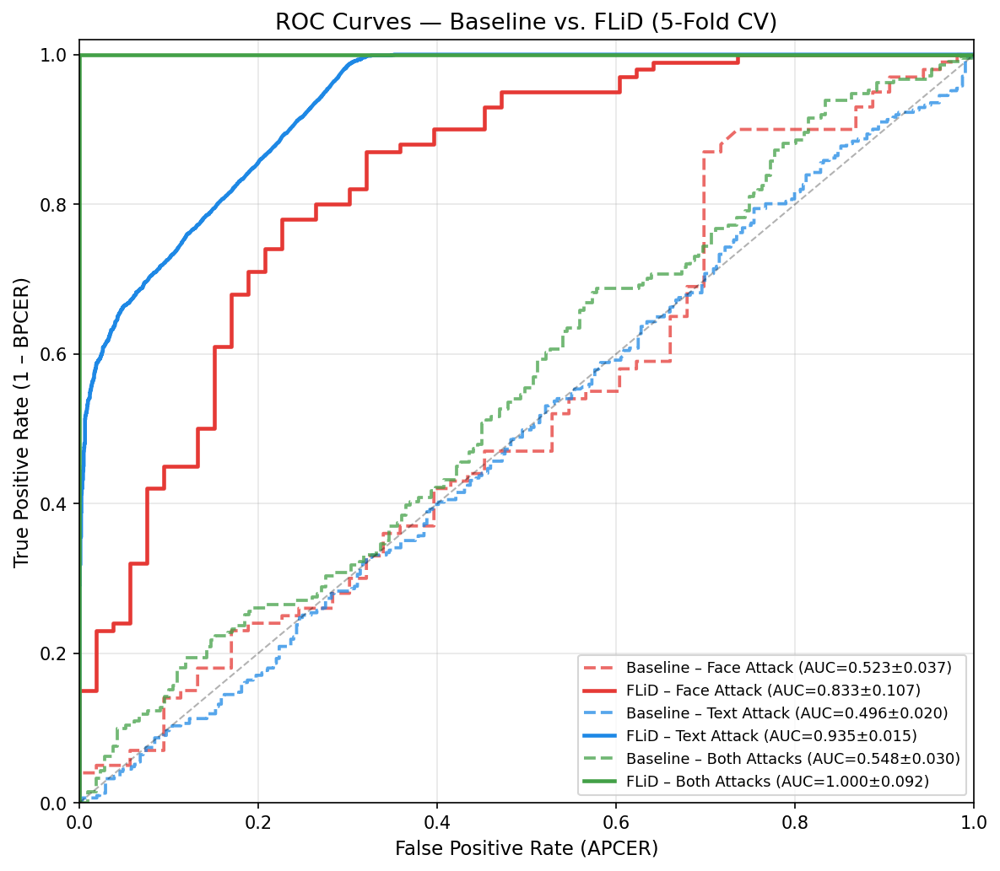
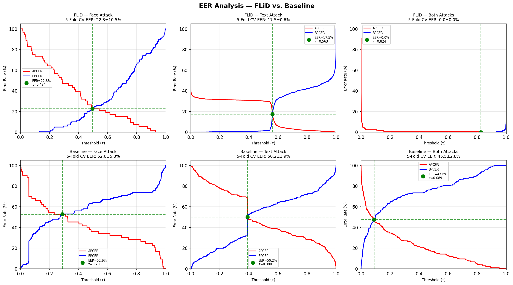
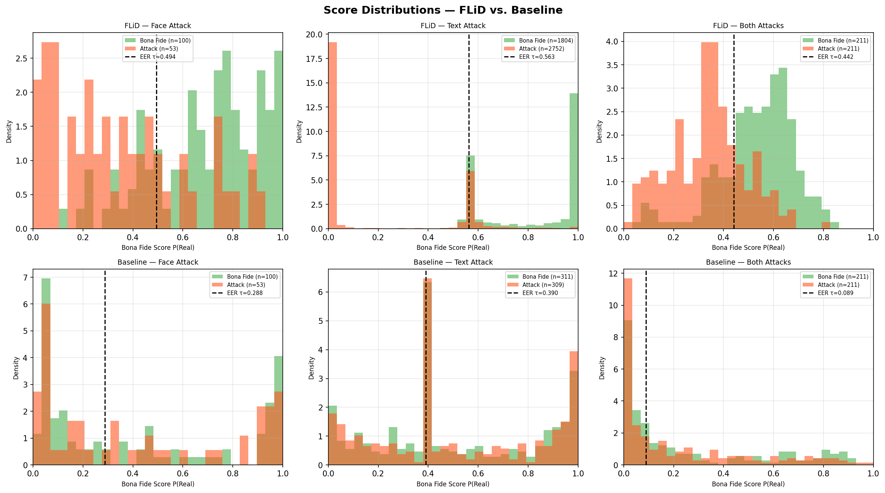

# FLiD: Field-Localised Identity-Document Forgery Detection

Official code for **"FLiD: Field-Localised Identity-Document Forgery Detection via Frozen-Backbone Embeddings"**

FLiD is a lightweight presentation-attack detection (PAD) method for
identity documents that decomposes each document into semantically
meaningful fields (face photograph, textual data) and classifies them
independently using **frozen MobileNetV3-Small embeddings** fed into
lightweight MLP heads.

---

## Key Results (5-fold Document-Level CV)

> **Note:** All results use **document-level** (`StratifiedGroupKFold`) splits — no
> document identity spans train/test boundary. Earlier sample-level splits inflated
> metrics by leaking augmented/patched variants of the same document across folds.

| Attack   | AUC            | EER (%)        | BPCER\@10 (%)  | BPCER\@20 (%)  |
|----------|----------------|----------------|----------------|----------------|
| **Face** | 0.809 ± 0.107  | 22.27 ± 10.53  | 49.0 ± 35.3    | 72.0 ± 20.6    |
| **Text** | 0.774 ± 0.015  | 17.52 ± 0.64   | 26.9 ± 1.5     | 33.7 ± 1.7     |
| **Both** | 0.906 ± 0.092  |  0.00 ± 0.00   |  0.0 ± 0.0     |  0.0 ± 0.0     |

The baseline (Gonzalez & Tapia, MobileNetV2 from scratch) achieves
near-chance performance on the same folds (AUC ≈ 0.49–0.56, EER ≈ 45–53%).

### ROI Crop vs Full-Image Ablation

| Attack | AUC (ROI crop) | AUC (full image) | Gain   |
|--------|---------------|-----------------|--------|
| Face   | **0.809**     | 0.636           | +0.173 |
| Text   | **0.774**     | 0.655           | +0.119 |
| Both   | **0.906**     | 0.831           | +0.075 |

### Efficiency

| Method    | Trainable Params | FLOPs  | Latency (CPU) |
|-----------|-----------------|--------|---------------|
| **FLiD**  | 191 K            | 119 M  | 16.8 ms       |
| Baseline  | 2.55 M           | 2503 M | 37 ms         |

13× fewer parameters · 21× fewer FLOPs · 2.2× faster

### Sample Figures

<p align="center">
  
</p>
<p align="center"><em>ROC curves — FLiD vs Baseline across all three attack scenarios</em></p>

<p align="center">
  
</p>
<p align="center"><em>EER analysis — FLiD (top row) vs Baseline (bottom row)</em></p>

<p align="center">
  
</p>
<p align="center"><em>Score distributions — FLiD (top row) vs Baseline (bottom row)</em></p>

> **All results** (JSONs + 19 plots) are in [`results/`](results/).

---

## Repository Structure

```
FLiD/
├── README.md
├── requirements.txt
├── LICENSE
├── .gitignore
├── configs/
│   └── paths.py                    # All dataset & output paths (edit BASE here)
├── flid/                           # FLiD approach (ours)
│   ├── models.py                   # MobileNetV3 extractor + MLP classifiers
│   ├── metrics.py                  # ISO/IEC 30107-3 metrics (EER, BPCER)
│   ├── data.py                     # Embedding loaders (all return doc_names)
│   └── train_kfold.py              # 5-fold document-level CV + bootstrap CIs
├── baseline/                       # Gonzalez & Tapia re-implementation
│   ├── model.py                    # MobileNetV2PAD (from scratch)
│   ├── train.py                    # Single train/test run
│   └── train_kfold.py              # 5-fold document-level CV
├── yolo/                           # YOLOv8 field detector
│   ├── finetune.py                 # Fine-tune YOLOv8m
│   ├── generate_annotations.py
│   ├── crop_faces.py               # Face-region extraction
│   └── crop_text.py                # Text-region extraction
├── evaluation/                     # Analysis & ablation scripts
│   ├── leakage_audit.py            # Verify zero document overlap per fold
│   ├── efficiency.py               # Params / FLOPs / latency
│   ├── ablation.py                 # Five ablation studies
│   ├── fair_comparison.py          # YOLO vs coord-crop comparison
│   ├── backbone_kfold_ablation.py  # Backbone comparison (MNV3 / EffNet / ResNet)
│   ├── roi_vs_wholeimage_ablation.py
│   └── augmentation_ablation.py
├── results/                        # Results & paper figures
│   ├── kfold/                      # 5-fold CV JSONs (FLiD + baseline)
│   └── plots/                      # 19 paper figures (ROC, EER, DET, scores, bars)
└── scripts/
    ├── extract_embeddings.py       # Extract MobileNetV3 embeddings from dataset
    ├── update_results_and_plots.py # Copy outputs → results/ and regenerate plots
    ├── generate_detailed_plots.py  # Per-attack ROC, DET, EER, score plots
    ├── generate_cascade_plots.py   # Combined cascade figures
    └── run_all.sh                  # Reproduce all experiments
```

---

## Quick Start

### 1. Install dependencies

```bash
python -m venv .venv && source .venv/bin/activate
pip install -r requirements.txt
```

### 2. Configure paths

Edit `configs/paths.py` and set `BASE` to the root of your data directory:

```python
BASE = Path('/path/to/your/data')   # must contain test-train_data/
```

### 3. Extract embeddings

```bash
# ROI-crop embeddings (used for all main results)
python scripts/extract_embeddings.py --attack all

# Full-image embeddings (for ablation comparison)
python scripts/extract_embeddings.py --attack all --full_image
```

This reads JPG images + paired JSON annotations from `test-train_data/`,
crops face and text regions using bounding boxes, and writes:

```
embeddings/Face_attack.json
embeddings/Text_attack.json
embeddings/Both_attack.json
```

### 4. Verify leakage-free splits

```bash
python -m evaluation.leakage_audit
```

Expected output: `doc overlap per fold: [0, 0, 0, 0, 0]` for all attacks.

### 5. Run FLiD 5-fold CV

```bash
python -m flid.train_kfold --attack all      # all three attacks
python -m flid.train_kfold --attack Face     # single attack
python -m flid.train_kfold --full_image      # full-image ablation
```

### 6. Run baseline 5-fold CV

```bash
python -m baseline.train_kfold --attack all
```

### 7. Update results and regenerate plots

```bash
python scripts/update_results_and_plots.py   # bar charts + summary
python scripts/generate_detailed_plots.py    # ROC, DET, EER, score plots
python scripts/generate_cascade_plots.py     # combined cascade figures
```

### 8. Efficiency analysis & ablations

```bash
python -m evaluation.efficiency
python -m evaluation.ablation
python -m evaluation.fair_comparison
```

### 9. YOLO field-detector pipeline (optional)

```bash
python -m yolo.generate_annotations
python -m yolo.finetune
python -m yolo.crop_faces
python -m yolo.crop_text
```

---

## Dataset

This repository does **not** include the Fantasy-ID dataset. The raw dataset
should be placed at `BASE/test-train_data/` with the following structure:

```
test-train_data/
├── Face_attack/  {Real, Fake} / {train, test} / *.jpg + *.json
├── Text_attack/  {Real, Fake} / {train, test} / *.jpg + *.json
└── Both_attack/  {Real, Fake} / {train, test} / *.jpg (+ *.json for Real)
```

Each JSON contains `person_info.face_id` (document identity used for
leakage-free grouping) and `regions` (bounding boxes for face and text fields).

**Dataset statistics:**

| Attack | Real | Fake | Total | Unique docs |
|--------|------|------|-------|-------------|
| Face   | 100  | 53   | 153   | 100         |
| Text   | 311  | 309  | 620   | 362         |
| Both   | 211  | 211  | 422   | 211         |

362 unique ID designs · 13 templates · 10 languages

---

## Architecture

### FLiD

```
Input (224×224) → MobileNetV3-Small (frozen, ImageNet weights)
                    → 576-D embedding
                    → MLP classifier → P(attack)
```

**Face MLP:** 576 → 256 → 128 → 64 → 32 → 1  
**Text MLP:** 576 → 256 → 128 → 64 → 32 → 1  
**Both MLP:** 1152 → 512 → 256 → 128 → 64 → 1  (concatenated face + text)

All MLPs use ReLU activations, 20% dropout, and BCEWithLogitsLoss with
class-weight balancing. Only MLP heads are trained (~191K parameters).

### Baseline (Gonzalez & Tapia)

```
Input (448×448) → MobileNetV2 (trained from scratch, Kaiming init)
                    → 2-class softmax
```

For Both_attack: cascade = min(Face P(Real), Text P(Real)).

---

## Metrics

All metrics follow **ISO/IEC 30107-3**:

- **APCER** — Attack Presentation Classification Error Rate
- **BPCER** — Bona Fide Presentation Classification Error Rate
- **EER**   — Equal Error Rate (operating point where APCER = BPCER)
- **BPCER\@N** — BPCER when APCER ≤ 1/N (e.g., BPCER\@10 at APCER ≤ 10%)

Bootstrap 95% confidence intervals are computed from 1000 resamples of
the 5 per-fold values.

---

## Reproducibility

All splits use `StratifiedGroupKFold(n_splits=5, shuffle=True, random_state=42)`
grouped by `face_id` (document identity). This guarantees that no document
— including its augmented or patched variants — appears in both the train
and validation partition of any fold.
