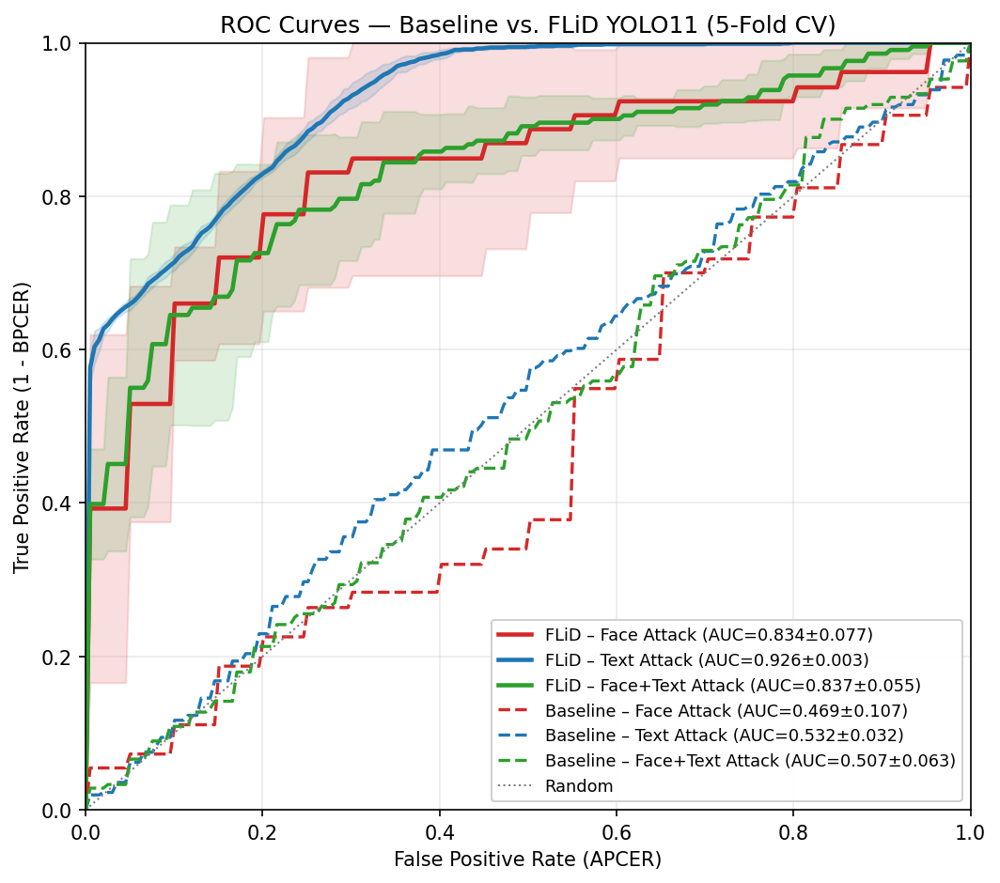
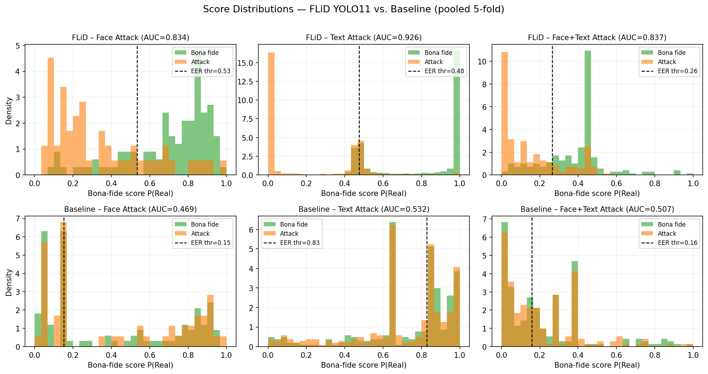

# FLiD: Field-Localized Forgery Detection for Digital Identity Documents

Official code for **"Field-Localized Forgery Detection for Digital Identity Documents."**

FLiD is a lightweight, field-aware framework for detecting forgeries in
digital identity documents (eKYC / remote onboarding). Instead of processing
the full document image, FLiD localises the **face** and **textual** fields
with a fine-tuned **YOLO11** detector, encodes each field with a **frozen
MobileNetV3-Small** backbone, and classifies field-level forgeries with a
compact **191K-parameter** MLP head. Face and text detectors are trained
independently and combined by **score-level fusion** (per-field minimum) for
documents containing simultaneous manipulations — so combined-attack documents
are never needed during training.

---

## Key Results (5-fold cross-validation, document-identity-disjoint)

All folds are split by **document identity** (`StratifiedGroupKFold` on
`face_id`) so no identity — including its augmented/patched variants — appears
in both train and test. Early stopping and LR scheduling use an **inner
validation split** (15% of the training fold, partitioned by identity); the
held-out test fold is never used for model selection. The same protocol is
applied to the baseline.

### Detection performance — deployable YOLO11 pipeline vs. from-scratch baseline

| Metric            | Face (Base → FLiD) | Text (Base → FLiD) | Both (Base → FLiD) |
|-------------------|--------------------|--------------------|--------------------|
| **AUC** ↑         | 0.469 → **0.834**  | 0.532 → **0.926**  | 0.507 → **0.837**  |
| **EER (%)** ↓     | 53.36 → **24.68**  | 47.53 → **18.46**  | 51.18 → **23.20**  |
| **BPCER@10 (%)** ↓| 93.00 → **43.00**  | 90.03 → **27.03**  | 89.15 → **46.85**  |
| **Accuracy (%)** ↑| 50.4 → **75.2**    | 52.4 → **81.5**    | 48.8 → **76.8**    |

FLiD lowers Equal Error Rate by **28–29 percentage points** across all three
scenarios. The from-scratch full-document baseline (González & Tapia,
MobileNetV2) collapses to near-chance (AUC 0.47–0.53) under the identical
leakage-free protocol.


### Efficiency

| Method   | Trainable Params | FLOPs        |
|----------|------------------|--------------|
| **FLiD** | **191 K** (single) / 382 K (combined) | 119 M (single field) / 595 M (full multi-field doc) |
| Baseline | 2.55 M (single) / 5.10 M (combined 2-network) | 2,503 M (single pass) / 5,006 M (combined 2-pass) |

**13× fewer trainable parameters · ~21× fewer FLOPs per field** for single-attack
detection. For combined face+text attacks both heads (382 K) and up to five
backbone passes (~595 M FLOPs) are used — still **13× fewer parameters**
(382 K vs. the 5.10 M two-network baseline; the same ratio as single-field,
since only the lightweight heads are trainable) and **8.4× fewer FLOPs** than
the 5,006 M two-pass baseline.

### Figures

<p align="center"></p>
<p align="center"><em>ROC curves — FLiD (YOLO11) vs. baseline across face, text, and combined attacks.</em></p>

<p align="center"></p>
<p align="center"><em>Bona-fide vs. attack score distributions.</em></p>


All result JSONs and figures are in [`results/`](results/).

---

## Repository structure

```
FLiD/
├── README.md
├── LICENSE
├── requirements.txt
├── .gitignore
├── configs/
│   └── paths.py                       # All dataset / output paths (edit BASE here)
├── flid/                              # FLiD approach (ours)
│   ├── models.py                      # Frozen-backbone embedding + MLP head
│   ├── metrics.py                     # ISO/IEC 30107-3 metrics (EER, BPCER, AUC)
│   ├── data.py                        # Embedding loaders (return document ids)
│   └── train_kfold.py                 # 5-fold document-level CV utilities
├── baseline/                          # González & Tapia re-implementation
│   ├── model.py                       # MobileNetV2PAD (from scratch)
│   └── train_kfold.py                 # Baseline dataset / loader / CI helpers
├── evaluation/                        # Analysis
│   └── efficiency.py                  # Params / FLOPs
├── scripts/                           # End-to-end pipeline
│   ├── prepare_yolo_dataset.py        # Build YOLO dataset from annotations
│   ├── finetune_yolo11.py             # Fine-tune YOLO11 field detector
│   ├── extract_embeddings.py          # GT-crop embeddings (MobileNetV3)
│   ├── extract_yolo_embeddings.py     # YOLO11-crop embeddings (deployable)
│   ├── extract_coarse_embeddings.py   # Coarse single-box embeddings
│   ├── run_kfold.py                   # Face/Text 5-fold CV, all backbones (Tables 1–2)
│   ├── run_both_cascade.py            # Both cross-attack cascade (per-field min)
│   ├── perfield_ablation.py           # Per-field-min Both ablation (all backbones)
│   ├── run_baseline.py                # From-scratch baseline 5-fold CV
│   ├── backbone_ablation.py           # Crop/embedding helpers for the ablation
│   ├── plot_acc_prec_comparison.py    # vs. TruFor / MMFusion / UniVAD
│   ├── generate_yolo11_plots.py       # ROC + score-distribution figures
│   └── run_all.sh                     # Reproduce the full pipeline
└── results/                           # Pre-computed results & paper figures
    ├── kfold/                         # 5-fold CV JSONs (FLiD + baseline)
    └── *.png / *.pdf                  # Paper figures
```


## Quick start

### 1. Install

```bash
python -m venv .venv && source .venv/bin/activate
pip install -r requirements.txt
```

### 2. Configure paths

Edit [`configs/paths.py`](configs/paths.py) and set `BASE` to your data root:

```python
BASE = Path('/path/to/your/data')   # must contain test-train_data/
```

### 3. Reproduce everything

```bash
bash scripts/run_all.sh
```

Or run stage by stage:

```bash
# (a) Fine-tune the YOLO11 field detector
python scripts/prepare_yolo_dataset.py
python scripts/finetune_yolo11.py

# (b) Extract field embeddings (GT / YOLO11 / coarse)
python scripts/extract_embeddings.py --attack all          # GT crops
python scripts/extract_yolo_embeddings.py --attack all     # YOLO11 crops (deployable)
python scripts/extract_coarse_embeddings.py                # coarse crops

# (c) 5-fold cross-validation (these produce the reported numbers)
python scripts/run_kfold.py            # Face / Text, all backbones (Tables 1–2)
python scripts/run_both_cascade.py     # Both (cross-attack cascade)
python scripts/perfield_ablation.py    # Both backbone ablation
python scripts/run_baseline.py         # from-scratch baseline

# (d) Figures
python scripts/generate_yolo11_plots.py
python scripts/plot_acc_prec_comparison.py
```

---

## Dataset

This repository does **not** include the dataset. Experiments use
[**FantasyID**](https://arxiv.org/abs/2507.20808) — 362 synthetic identity
documents generated without real personal data — placed at
`BASE/test-train_data/`:

```
test-train_data/
├── Face_attack/  {Real, Fake} / {train, test} / *.jpg + *.json
├── Text_attack/  {Real, Fake} / {train, test} / *.jpg + *.json
└── Both_attack/  {Real, Fake} / {train, test} / *.jpg (+ *.json for Real)
```


## Metrics

All metrics follow **ISO/IEC 30107-3**:

- **APCER** — Attack Presentation Classification Error Rate
- **BPCER** — Bona Fide Presentation Classification Error Rate
- **EER** — Equal Error Rate (operating point where APCER = BPCER)
- **BPCER@10** — BPCER at an APCER of 10%

We additionally report ROC AUC and Accuracy.

---

## License

Released under the [MIT License](LICENSE).
